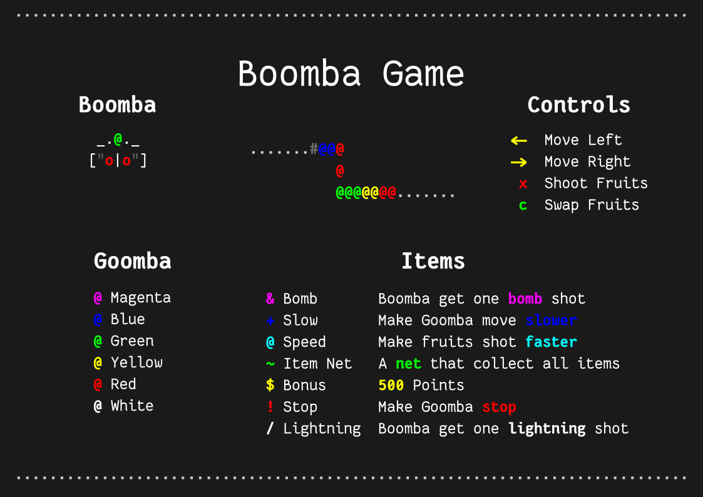

# Boomba



This game is called Boomba inspired by Zuma and Luxor which I use ncurses to render it on Terminal and SDL Mixer for sounds

## How to install (Linux)

My dependencies:

- `ncurses` 6.2 for rendering in terminal
- `libsdl` and `libsdl_mixer` 1.2 for sounds

Arch Linux

``` console
$ sudo pacman -S ncurses sdl_mixer
```

Ubuntu

``` console
$ sudo apt-get install libsdl-mixer1.2-dev libncurses5-dev
```

Run

``` console
$ ./main
```

Compile

``` console
$ make
```

## How to install (Windows)

Using Replit: https://replit.com/@KornYellow/boomba-cli

In Replit's terminal using command

``` console
$ make && ./main
```

## How to play

Navigating menu

- <kbd>↑</kbd> and <kbd>↓</kbd>: to choose menu
- <kbd>x</kbd>: confirm
  
Controlling player

- <kbd>←</kbd> and <kbd>→</kbd>: move
- <kbd>x</kbd>: shoot
- <kbd>c</kbd>: swap color
- <kbd>q</kbd>: pause
