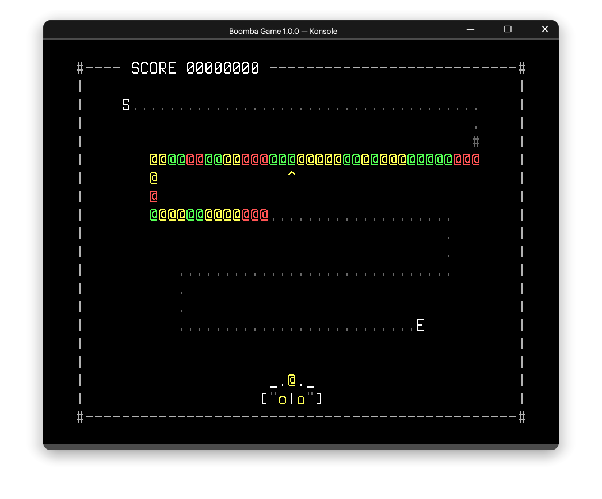

# Boomba




เกมนี่ชื่อว่า Boomba ได้แรงบันดาลใจจากเกม Zuma และ Luxor ซึ่งผมใช้ ncurses ในการแสดงผลลงบน Terminal และ SDL Mixer ในการเล่นเสียงเพลง

## วิธิการติดตั้งและเล่น สำหรับ Linux เท่านั้น TT

Dependencies ต่าง ๆ:

- `ncurses` 6.2 สำหรับแสดงผลลงบน Terminal
- `libsdl` และ `libsdl_mixer` 1.2 สำหรับเสียง

ติดตั้งบน Arch Linux

``` console
$ sudo pacman -S ncurses sdl_mixer
```

ติดตั้งบน Ubuntu

``` console
$ sudo apt-get install libsdl-mixer1.2-dev libncurses5-dev
```

เล่นเกม!

``` console
$ ./main
```

คอมไพล์เกม

``` console
$ make
```

## วิธีเล่นเกม

การจัดการเมนูของเกม

- <kbd>↑</kbd> และ <kbd>↓</kbd>: เพื่อเลือกเมนู
- <kbd>x</kbd>: คอนเฟิร์ม
  
การจัดการผู้เล่น

- <kbd>←</kbd> และ <kbd>→</kbd>: เคลื่อนที่
- <kbd>x</kbd>: ยิงกระสุน
- <kbd>c</kbd>: สลับสี
- <kbd>q</kbd>: หยุดเกม
